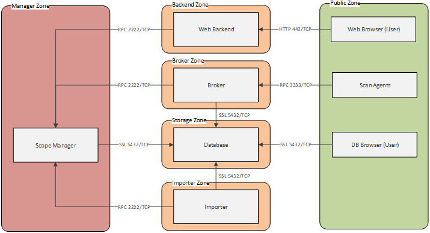
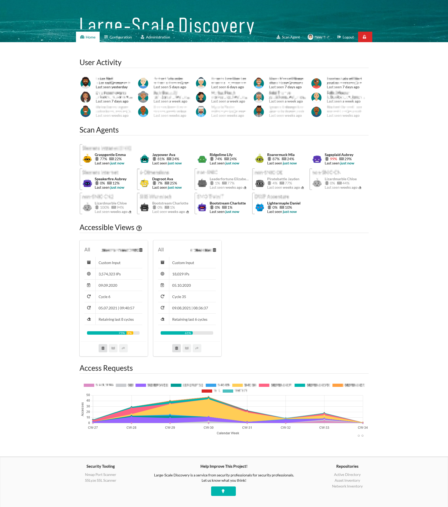
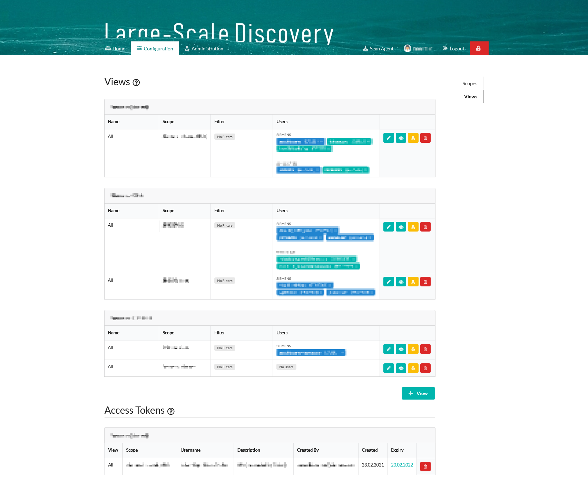
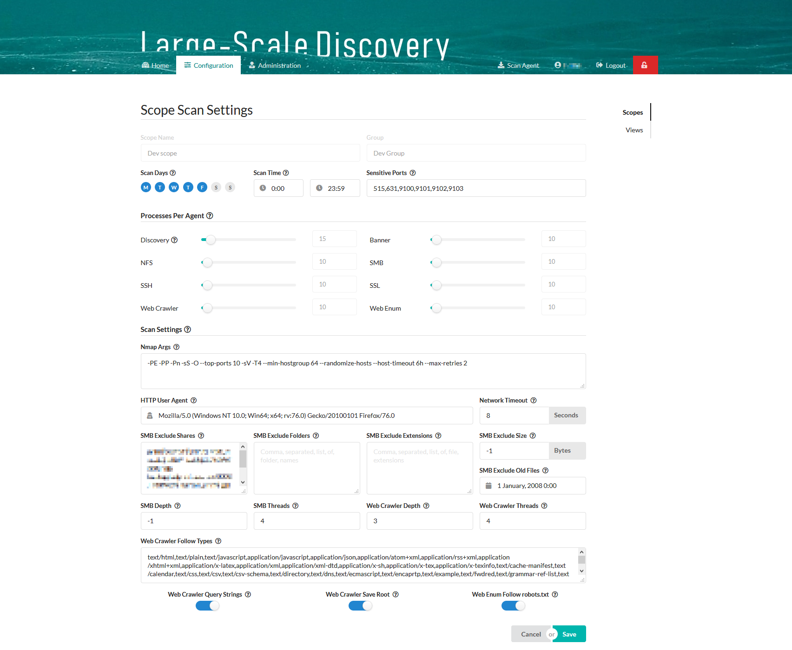
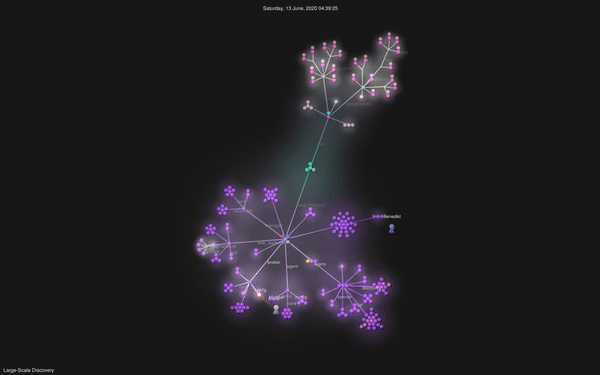

# Large-Scale Discovery

Large-Scale Discovery is a solution for discovering assets, services and contents and metadata within large IT/OT
networks. It relies on a few basic well-known open-source tools ([Nmap](https://nmap.org/)
, [SSlyze](https://github.com/nabla-c0d3/sslyze/releases))
and is extended with additional scan logic and several custom scan modules.

Results are collected in a structured repository of things visible and accessible. Data can be searched, filtered,
combined, post-processed and visualized as desired via a common database browsers, custom scripts or third party BI
software.

- Discover or identify assets and contents unknown before
- Discover implicit IT security issues by analyzing result data
- Get insight into an invisible situation

Related services or solutions are [Shodan](https://www.shodan.io/), respectively, [IVRE](https://ivre.rocks/)
and [Natlas](https://natlas.io/). In contrast, Large-Scale Discovery is going deeper into common communication
protocols (HTTP, SMB,...) to discover contents and includes user and access management.

## Key Features

- Web interface for scan configuration and control
- Multiple scan scopes, groups and users possible
- Continuous scans to keep data updated
- Scan agents can be put into dedicated network zones
- Randomization of scan targets for load distribution
- Restriction of scan times to local working hours (e.g. during office times or outside)
- Scalable configuration and parallelization
- Discovery of potential hostnames from different sources
- Data expansion with information from remote repositories, e.g., Active Directory
- Versatile scan module configuration
- Lowest possible dependency stack
- ...

## Scan modules

- Asset and service discovery
- Banner grabbing
- SMB crawling
- NFS crawling
- Web crawling
- Web enumeration
- SSH enumeration
- SSL enumeration

## Components

The solution comprises several software components. Some of them are optional, and they can be hosted individually and
in parallel to scale:

- *Scope manager* (`manager`): (Sensitive) central component managing existing scan scopes, respective storage
  databases, views, access rights and credentials.
- *Broker* (`broker`): Intermediary component, linking scan agents to assigned scan scopes, deciding and distributing
  scan tasks across connected scan agents.
- *Scan agent* (`agent`): Executing component containing scan logic and taking care of the execution of actual network
  scans, as instructed by the broker.


- *Web Interface*  (`web_backend` + `web_frontend`): Control component allowing users to configure scan scopes, scan
  settings, manage result access rights and to monitor scan progress. Alternatively, you may configure scan scopes
  manually or write your own scripts.
- *Importer* (`importer`): Optional utility component to sync scan scope inputs with external sources. This component is
  not necessary for _custom_ scan scopes, which are directly populated from the user input via the web interface. The
  importer can be deployed to import scan inputs from external sources, e.g. a network or asset repository.

  

# Code Philosophy

This project intends to keep the initial effort to get rolling as little as possible. Things should work out of the box.
Just click 'compile', and you will notice only a few dependencies that need to be prepared manually (
see [Preparation](#preparation)). If you compile with build tag 'prod', all development settings and code will be
hardened, respectively, stripped.

# Development

## GIT configuration

If you plan to submit code, please setup your GIT, e.g.:

```
git config --global user.name "Name Surname"
git config --global user.email "...@domain.tld"
```

## Manager, broker & agent for scanning

#### Preparation

* Install a local **development** PostgreSQL with the following configuration:

```
        Host: localhost     (do NOT enable listening on the external interface!)
        Port: 5432
        User: postgres      (administrative user required to manage databases)
        Pass: test123!$LSD  (do NOT use in production!)
```

* Install GCC and make sure it is in your environment variable (https://sourceforge.net/projects/mingw-w64/files).
  Select `x64` in the installation wizard!
* Checkout source code directly into `[...]/go/src/`.
* Edit `./_test/settings.go`and replace the dummy e-mail address.
* Put the following file on your commit ignore list to avoid accidental commits: `./_test/settings.go`.
* Download and install Nmap (https://nmap.org/) and SSLyze (https://github.com/nabla-c0d3/sslyze) to `./_bin/tools`. You
  can install them anywhere, but then you'll need to update the paths in `agent.conf` later on.
* **Configure the working directory** in your build configurations to `./_bin/` (we've prepared some necessary files
  there).

#### First launch

* Launch _manager_, it will generate a default `./_bin/manager.conf` file.
* Launch _broker_, it will generate a default `./_bin/broker.conf` file.
* Launch _agent_, it will generate a default `./_bin/agent.conf` file.
* Launch _agent_ **again** with `-setup` argument to prepare the operating system.
* Launch _manager_ **again**, it will prepare a development scan scope and some dummy data
* Launch _broker_  **again**, it will connect to the scope database (PostgreSQL) on localhost and initialize necessary
  database tables.
* Insert sample scan targets from `./_bin/t_discovery_sample.sql` (or better, your own) into the scan scope's respective
  input table `t_discovery`.

All components are pre-configured and should directly start interacting with each other after launching in development
mode. Similarly, in production mode, but with hardened configuration.

#### Scan process

* Launch _manager_, it holds available databases and knows/manages existing scan scopes (tables, views, access
  rights,...). It will create/migrate database tables if necessary. It provides an RPC API for other components to query
  and alter scopes and attributes.
* Launch _broker_, it will query known scopes, and their database connection details from the _manager_ and wait for _
  agent_ connections. It provides an RPC API for scan agents to request scan tasks and send scan results.
* Launch _agent_, it will connect to the _broker_ and request scan targets.
    * It will tell the _broker_ which tasks are currently running. The _broker_ will return scan tasks based on the
      associated scope's configuration.
* The _agent_ tells the _broker_ how many scan jobs of which kind are currently running. The _broker_ will decide which
  and how many more scan tasks shall be started additionally.
    * Main scan targets are taken from the scan scope's database table `t_discovery`. The `scan_started` attribute is
      set to indicate an active process.
    * Main scan results will be written back to the database tables `t_discovery_hosts`, `t_discovery_services`
      and `t_discovery_scripts`.
    * Submodule scan targets are extracted from the main scan results and kept in the _broker_'s cache (persistent
      SQLite DB).
    * Submodule scan targets are taken from the _broker_'s cache. The `scan_started` attribute is set to indicate an
      active process.
    * Submodule scan results will be written back to the respective scan scope database table, e.g. `t_ssl` and
      associated ones (`t_ssl_certificates`, `t_ssl_ciphers`,...).
    * You can open the cache `./_bin/broker.sqlite` with an SQLite browser and watch submodule targets being created and
      getting processed.
* Scan scopes are managed via the _web frontend_ (see below), which is connected to the _web backend_, which is
  connected to the _manager_.

## Web frontend for managing scan scopes

#### Preparation

* Install node.js (v10 or v11), which is used for dependency management and generating an optimized deployment version
  of the application later.
* Download dependencies. Most of them are only required to support development, some of them are actively used within
  the web application. See *package.json* for details. Open command line in `./web_frontend` and run:

```
npm install
```

* Launch the _web backend_ `./web_backend`. Beside serving the REST API called by the _web frontend_, the _web backend_
  does also serve the _web frontend_ application files (HTML) from the `./web_frontend/src/` folder (
  or `./web_frontend/dist` in production mode).
* Depending on the browser you might need to disable HTTP caching to avoid JavaScript **files being taken from cache**.
  In Firefox CTRL+F5 does not suffice, but you can disable HTTP caching in the developer toolbar for the time it's
  open (https://stackoverflow.com/a/48027947). You could also use a private tab, but reloading would also discard the
  authentication token.
* Access the _web frontend_ at https://localhost/
* You do **not** need to "build" the web application during development. Building is just an optimization step before
  deployment. It generates an optimized production-ready version of the web application. E.g., it combines all JS and
  CSS files into one, minifies them, moves necessary files into a common structure, updates paths, etc... (according to
  the rules described in `gulpfile.js`). The output is put into the `./dist` sub folder, where it is taken from by the _
  web backend_ in production mode.

```
gulp
```

#### Folder description

* `./web_frontend` - Root folder of the web application
    * `./src` - Source files of the web application
        * `/app` - Main app folder with configuration files and initializers for the *Knockout* JavaScript framework.
        * `/components` - Application modules/elements which can be integrated and reused everywhere via HTML tags. **
          Each component needs to be initially registered in `./app/main.js` and added in the `gulpfile.js` file for
          building.**
        * `/pages` - The html/js code for the available pages which are loaded by their specific routes. **Each page
          needs to be initially registered in `./app/main.js`, assigned to a route in `./app/router.js` and added in
          the `gulpfile.js` file for building.**
    * `./dist` - Release folder, where "gulp" is putting the optimized production ready web application.
    * `./node_modules` - Packages and their dependencies maintained by npm. Note most packages are used only for the "
      gulp" build process.
    * `./gulpfile.js` - Gulp build script for building a production-ready version of the web application.
    * `./package.json` - Npm list of packages required for the web application or throughout the development process.

# Production

#### Building on Windows for Windows

Go to `./_bin` and execute `build_prod_win.bat` to create production builds. Production builds will:

- exclude development code (by applying build tag 'prod')
- apply more secure/realistic production setting
- strip debug symbols

#### Building on Linux for Linux

Go to `./_bin` and execute `build_prod_lin.sh` to create production builds. Production builds will:

- exclude development code (by applying build tag 'prod')
- apply more secure/realistic production setting
- strip debug symbols

It's easiest to not bother cross-compiling and just use a Linux machine (e.g. VM) to build for Linux.

## Screenshots

<kbd>

</kbd>
Dashboard
<br/><br/>
<kbd>

</kbd>
Scope configuration
<br/><br/>
<kbd>

</kbd>
Views configuration and access rights
<br/><br/>
<kbd>

</kbd>
Scan settings

# Some entertainment

[](https://www.youtube.com/watch?v=)
<br />[[Full Video](https://www.youtube.com/watch?v=)]
